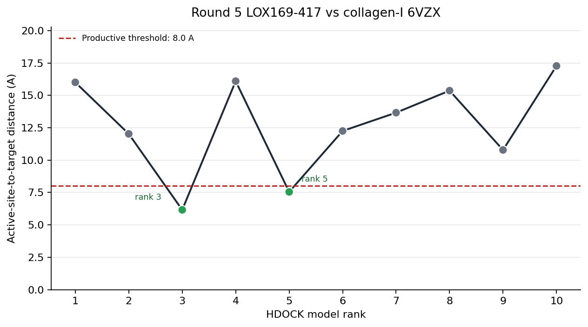

# LOXDockAudit

[](https://github.com/G1F12/LOXDockAudit/actions/workflows/ci.yml)

Negative-control-aware docking and productive geometry auditor for LOX-collagen engineering.

## Current status

Validated MVP, v0.2.1 reproducibility release.

- Unit tests: 105+ passing
- Integration tests: passing
- mypy: passing
- ruff: passing
- Windows CLI smoke test: passing
- Real HDOCK Round 5 example: reproducible

## What it solves

LOXDockAudit audits docking screens where the key question is not just whether a
construct binds collagen, but whether the LOX active site is positioned near a
target Lys/Hyl residue in a potentially productive geometry.

## Why this exists

Generic docking scores are often insufficient for enzyme-matrix engineering. In
LOX-collagen systems, a construct may bind collagen but fail to place the LOX
active site near a Lys/Hyl substrate residue. LOXDockAudit was built to separate
generic binding from potentially productive catalytic geometry and to reduce
cherry-picking through input auditing and control-aware reporting.

## Why strict controls matter

Fusion constructs can look good by generic contact count while failing the actual
geometric requirement. Baseline, scrambled, polyK, noCBD, inactive, and benchmark
controls make the interpretation explicit: a candidate should beat relevant
negative controls, not just produce a plausible docking pose.

## Why naive docking ranking fails

Docking rank is not the same as catalytic usefulness. A top-ranked pose can be
nonproductive if the active-site residues are far from the target collagen
substrate atom. LOXDockAudit keeps HDOCK numeric ordering intact while reporting
the first productive rank separately.

## Why scrambled and polyK controls matter

Scrambled and polyK controls help detect nonspecific binding. If a candidate does
not outperform these controls in productive pose count or best active-site
distance, the docking result is not strong evidence for a specific engineered
interaction.

## Why productive geometry beats docking score

For LOX-collagen engineering, the most relevant docking signal is active-site
proximity to the target Lys/Hyl residue. LOXDockAudit reports this explicitly as
distance, productive pose count, best productive rank, and contact context.

## Usage

```bash
loxdockaudit check-config configs/example.yaml
loxdockaudit run --config configs/example.yaml --out examples/reports
```

## Real Round 5 reproduction

Packaged reproducible example:

```bash
loxdockaudit check-config examples/real_hdock_round5/config.yaml
loxdockaudit run --config examples/real_hdock_round5/config.yaml --out examples/real_hdock_round5/expected_output --top-n 10
```

Dataset: R5 LOX169-417 vs collagen-I 6VZX

Result after numeric model sorting:

- Productive poses: 2/10
- Best distance: 6.159 A
- Best productive rank: 3

Real output excerpt:

```text
## Productive Geometry

- Productive poses: 2 / 10
- Best distance: 6.159 A
- Best productive rank: 3
- Productive distance threshold: 8.000 A
- LOX contact frequency: 1.000
- CBD contact frequency: 0.000
- CBD coupling: 0.000
```



Interpretation: the real HDOCK dataset is parsed successfully, and
productive-rank calculation now uses numeric model ordering rather than
lexicographic ordering.

See [REPRODUCING_ROUND5.md](REPRODUCING_ROUND5.md) for exact commands, expected
outputs, and expected metrics.

## Limitations

LOXDockAudit does not prove enzymatic activity, Cu loading, LTQ/topaquinone
maturation, collagen oxidation, crosslink formation, tendon strengthening, or in
vivo safety.

It is a computational triage and reproducibility tool for docking-screen
interpretation.
