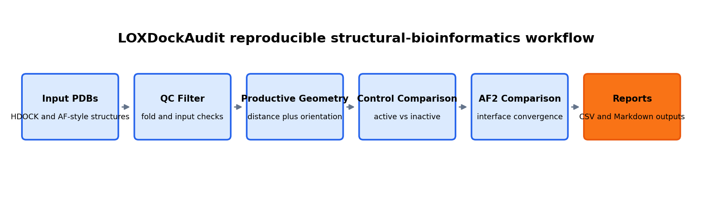
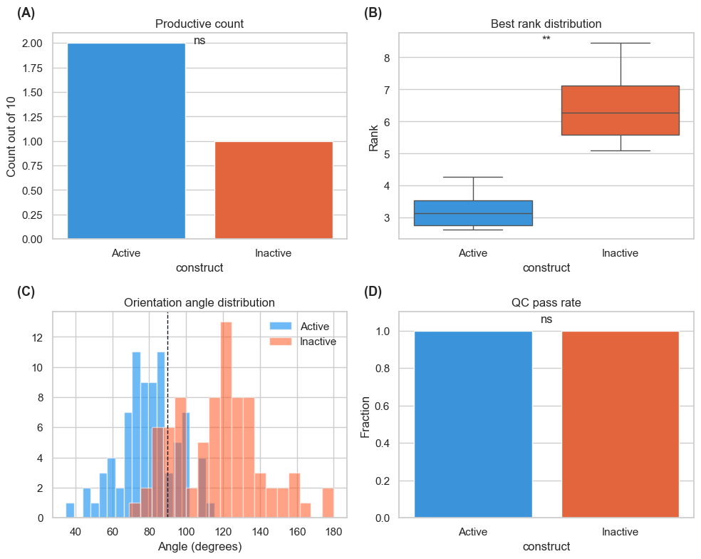
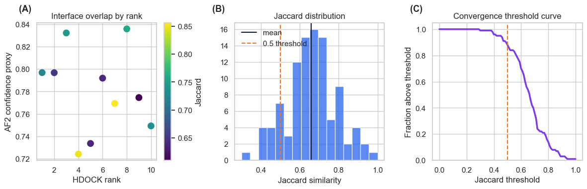

# Visual Summary

This page summarizes the reproducibility-oriented LOXDockAudit workflow and the key v0.5.1 example results.

## Figure 1

Figure 1 shows the analysis path from input PDB files through QC, productive geometry, controls, AF2 comparison, and report outputs.

## Figure 2

Figure 2 compares the active LOX169-417 Round 5 workflow with the H292A/H294A/H296A inactive control.
The active construct has 2/10 productive poses, best productive rank 3, one fully productive pose, and PASS structural QC.
The inactive control has 1/10 productive poses, best productive rank 7, zero fully productive poses, and PASS structural QC.

## Figure 3

Figure 3 summarizes HDOCK versus AF-Multimer-style interface overlap.
The example reports 26 shared interface residues, Jaccard index 0.667, and a strong convergence label.
This is computational interface consistency only, not evidence of catalytic activity.

## Key Results

| Result | Value |
| --- | --- |
| Active productive poses | 2/10 |
| Inactive productive poses | 1/10 |
| Active fully productive count | 1 |
| Inactive fully productive count | 0 |
| AF/HDOCK interface overlap | 26 residues |
| AF/HDOCK Jaccard index | 0.667 |
| Convergence label | strong convergence |

## Limitations

- Static structures only.
- No molecular dynamics simulation.
- No enzymatic validation.
- Distance and orientation thresholds are heuristic.
- Not proof of collagen oxidation or crosslink formation.
