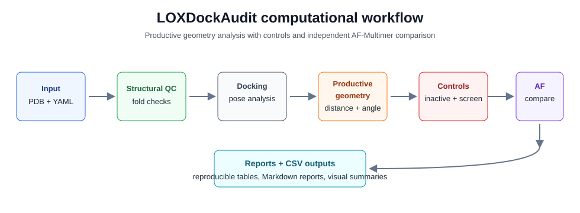

# LOXDockAudit Visual Summary

LOXDockAudit is a reproducibility-focused computational biology tool for
auditing LOX-collagen docking poses by productive geometry rather than docking
rank alone.

## Workflow Diagram

## Active vs Inactive Summary

| Metric | Active | Inactive |
| --- | ---: | ---: |
| Productive poses | 2/10 | 1/10 |
| Best productive rank | 3 | 7 |
| Fully productive count | 1 | 0 |
| QC status | PASS | PASS |

## HDOCK vs AF Summary

| Metric | Value |
| --- | ---: |
| Interface overlap | 26 residues |
| Jaccard index | 0.667 |
| Convergence label | strong convergence |

Strong convergence indicates computational agreement between docking and
AF-Multimer interface regions under the configured contact metric. This is
cross-method structural consistency, not biological validation.

## Limitations

- Static structures only.
- No molecular dynamics simulation.
- No enzymatic validation.
- Distance and orientation thresholds are heuristic.
- Not proof of collagen oxidation or crosslink formation.

## Portfolio Takeaway

The project combines deterministic input auditing, structural QC, docking pose
analysis, active/inactive controls, and independent AF-Multimer comparison into
one reviewable workflow. Its outputs are designed to support cautious scientific
interpretation rather than overclaiming mechanism or activity.
